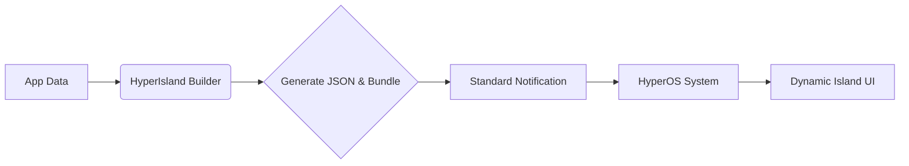

**HyperIsland ToolKit** is a powerful Kotlin library designed to bridge the gap between Android developers and Xiaomi's **HyperOS Dynamic Island** notification system (Focus Notifications).

Implementing Dynamic Island notifications natively requires constructing complex, undocumented JSON payloads and passing them via raw Bundles. This process is error-prone, hard to debug, and lacks type safety.

**HyperIsland ToolKit** solves this by providing a fluent, type-safe **Kotlin DSL Builder** that handles all the complexity for you.

## Latest Version: v0.4.3

* **New:** Support for **RemoteViews** (Custom Layouts).
* **Fix:** Improved AOD and Night mode handling.

## Why use HyperIsland ToolKit?

* **Type Safety:** No more manual JSON string concatenation. The library uses data classes to ensure your payloads are valid.
* **Comprehensive Support:** Covers all known templates (Chat, Media, Status, Timer, etc.).
* **Custom Views:** (New in v0.4.3) Use standard Android XML layouts when templates aren't enough.
* **Smart Defaults:** Automatically handles prefixes like `miui.focus.pic_` and `miui.focus.action_`, so you don't have to.
* **Modern API:** Designed with Kotlin best practices, using Builder patterns and scope functions for cleaner code.

## How it Works

The library wraps the standard Android `NotificationCompat` builder. You build your content using `HyperIslandNotification.Builder`, generate the payload, and attach it to a standard notification.

## Documentation Sections


  
  
  
  
